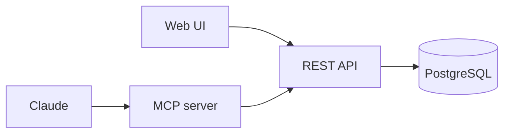
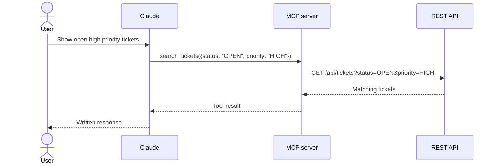
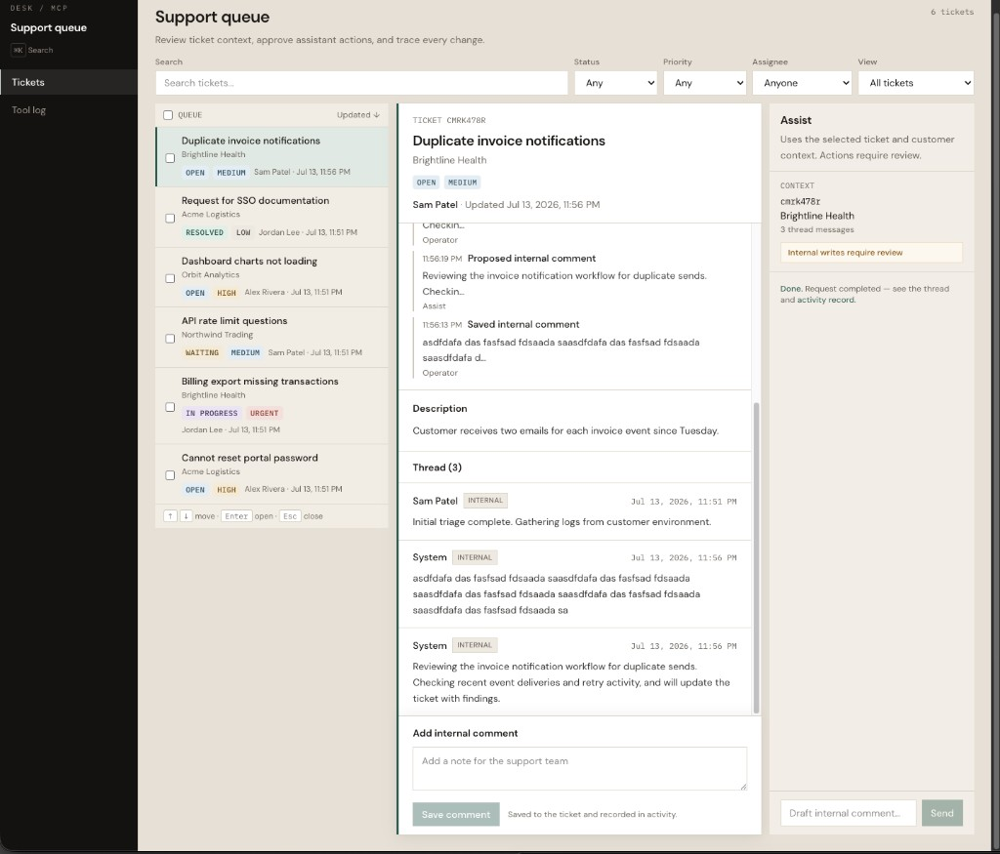
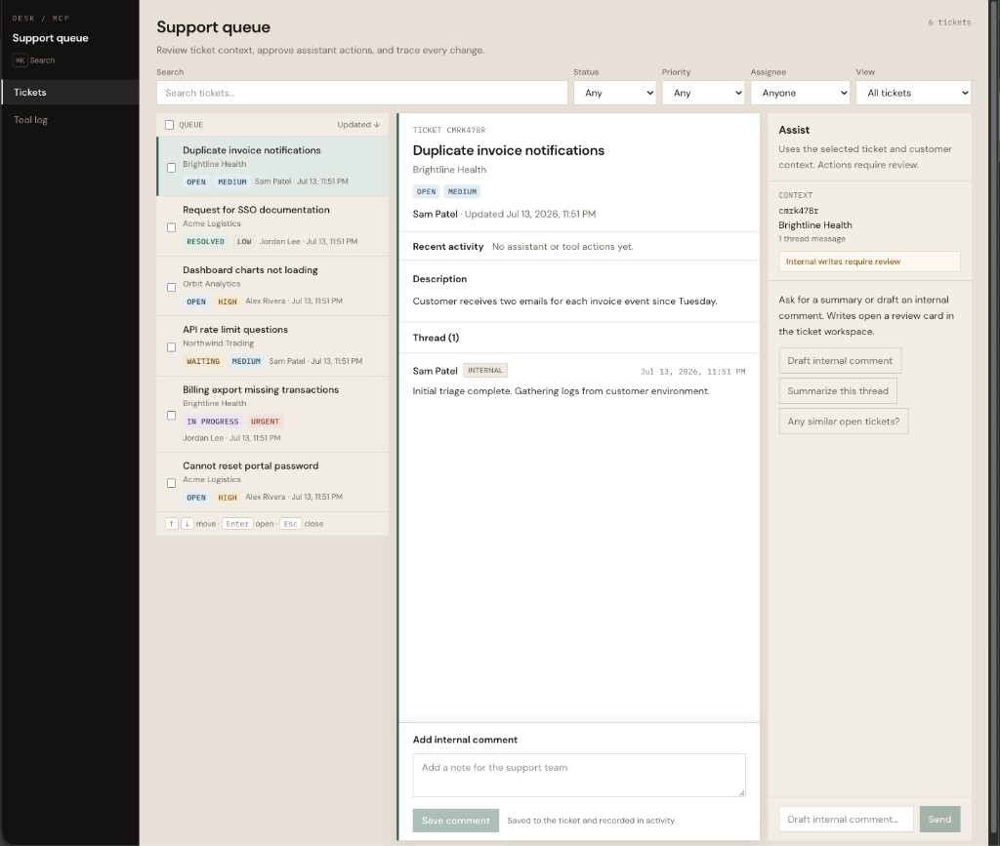
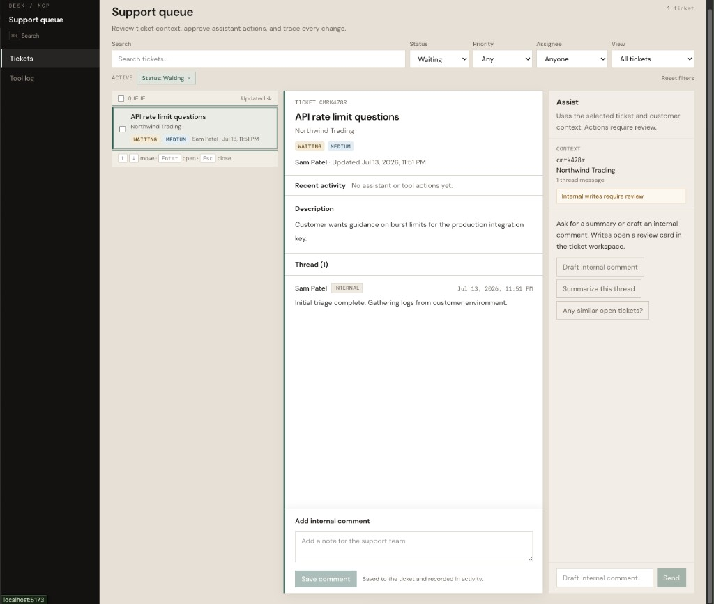

# Support Desk MCP

AI-assisted support desk with a polished React workflow UI, typed MCP tools, reviewable write actions, PostgreSQL, and unified audit logging.

A support desk built to show how AI agents can operate inside real product workflows. A human can work from a dense React queue, use keyboard navigation, ask an assistant for help, review proposed write actions, and see every browser or agent action in one audit trail.

Under the hood: Fastify API, React UI, MCP server, shared Zod tool schemas, PostgreSQL, and a unified audit log across browser and agent activity.

## What it does

- **REST API** (Fastify, Prisma, Postgres) for tickets, agents, comments, and audit logs.
- **Web UI** — TanStack Table queue with saved views, split-pane ticket workspace, command palette (`⌘K`), AI action review for internal comments, and a timeline-style tool log.
- **MCP server** with five Zod-validated tools. Same business logic as the API; writes require explicit confirmation.
- **Two transports:** stdio for local Claude setup, Streamable HTTP at `/mcp` for remote Claude connectors.



## New to MCP?

The MCP server does not interpret a user's sentence. The model inside Claude chooses a tool and produces structured arguments from the tool's description and schema. The server validates those arguments, calls the REST API, and returns the result.



For tool discovery, transports, the Ask the queue comparison, and a code-level walkthrough, read [How MCP fits together](./docs/how-mcp-works.md).

## Screenshots

| Review (hero) | Before | After |
|---|---|---|
|  |  |  |

Locked set (Review → Normal → Completed): [docs/screenshot-guide.md](./docs/screenshot-guide.md). Case study on [minkow.ski](https://minkow.ski/projects/support-desk-mcp).

## Quick start (web only)

Requires Node 24+, pnpm 10+, Docker.

```bash
pnpm setup
pnpm dev
```

- Web: http://localhost:5173
- API: http://localhost:3001

## Demo flow (portfolio)

One story to record or screenshot:

1. Open queue → apply **View → Open, high priority** (filter chips visible)
2. Select a ticket → split-pane detail opens
3. `⌘K` to search or jump
4. **Draft internal comment** in Ask the queue
5. Review proposed action → edit → **Confirm and save**
6. See comment in thread + activity strip + tool log

Step-by-step: [docs/demo.md](./docs/demo.md) · Screenshots: [docs/screenshot-guide.md](./docs/screenshot-guide.md)

## Full stack (web + MCP HTTP)

```bash
pnpm setup
pnpm run --parallel dev:api dev:web dev:mcp:http
```

- MCP: http://localhost:3002/mcp (see [docs/mcp-clients.md](./docs/mcp-clients.md))
- MCP health: http://localhost:3002/health

## Environment

`pnpm env:copy` writes `.env` into each app from the root example.

| Variable | App | Purpose |
|----------|-----|---------|
| `DATABASE_URL` | api only | Postgres connection |
| `API_PORT`, `API_KEY` | api | Server port and auth |
| `ANTHROPIC_API_KEY`, `ANTHROPIC_MODEL` | api | Optional free-text for Ask the queue |
| `API_BASE_URL`, `API_KEY` | mcp-server | Calls the REST API |
| `MCP_HTTP_PORT` | mcp-server | Streamable HTTP port (default 3002) |
| `VITE_API_BASE_URL`, `VITE_API_KEY` | web | Browser API client |

Postgres runs on host port **5433** via Docker. Use `pnpm db:up` to start in the background, or `pnpm db:watch` to run in the foreground with logs in your terminal (Ctrl+C stops the container).

## Web UI

| Surface | Purpose |
|---------|---------|
| Queue workspace | Sortable table, saved views, column visibility, row selection, split-pane detail |
| Ask the queue | Quick searches and draft internal comments for the selected ticket |
| Action review | Proposed writes shown as reviewable diffs before confirmation |
| Tool log | Timeline audit trail with actor/transport badges and expandable details |

Press `⌘K` (or `Ctrl+K`) for the command palette. Deep links: `/tickets/:ticketId` or `/?ticket=:ticketId`.

Ask the queue, browser forms, and MCP all log to Tool log. Actors are labeled (`web-assist`, `web-ui`, `mcp-agent`).

## MCP tools

| Tool | Type | Description |
|------|------|-------------|
| `search_tickets` | read | Text, status, priority, assignee filters |
| `get_ticket` | read | Ticket + comment thread |
| `list_agents` | read | Support agents |
| `add_comment` | write | Internal comment; `confirmed: true` required |
| `get_recent_agent_activity` | read | Recent audit entries |

Client setup (Claude): [docs/mcp-clients.md](./docs/mcp-clients.md)

## Project layout

```text
apps/
  api/           Fastify REST API
  mcp-server/    MCP (stdio + HTTP entry points)
  web/           React dashboard
packages/
  shared/        Zod schemas, API client, audit formatting
docs/
  demo.md        Local walkthrough
  how-mcp-works.md MCP concepts and request flow
  mcp-clients.md Transport and client config
```

## Scripts

| Command | Description |
|---------|-------------|
| `pnpm setup` | Install, env files, Postgres, migrate, seed |
| `pnpm dev` | API + web |
| `pnpm run --parallel dev:api dev:web dev:mcp:http` | API + web + MCP HTTP |
| `pnpm dev:mcp` | MCP stdio (local) |
| `pnpm dev:mcp:http` | MCP Streamable HTTP |
| `pnpm db:up` | Start Postgres in the background |
| `pnpm db:watch` | Start Postgres in the foreground (logs in terminal) |
| `pnpm db:down` | Stop Postgres |
| `pnpm run ci:all` | Lint, typecheck, tests |
| `pnpm db:reset` | Reset DB and re-seed |

## Security

- `/api/*` requires `x-api-key`.
- `/mcp` requires the same key via `Authorization: Bearer` or `x-api-key`.
- MCP `add_comment` requires `confirmed: true` so the model cannot write by accident.
- Tool calls are persisted in `AuditLog`.

## Regression testing

Pairs with [Agent Eval Harness](https://github.com/eminkowski/agent-eval-harness): import audit rows or record live MCP runs into trace JSON, then assert on tool choice, write guards, and ordering in CI. Case studies on [minkow.ski](https://minkow.ski/projects/support-desk-mcp) and [Agent Eval Harness](https://minkow.ski/projects/agent-eval-harness).

## License

MIT. See [LICENSE](./LICENSE).
