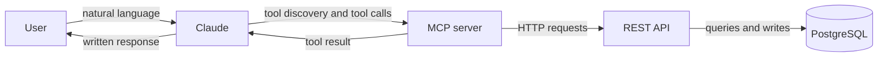
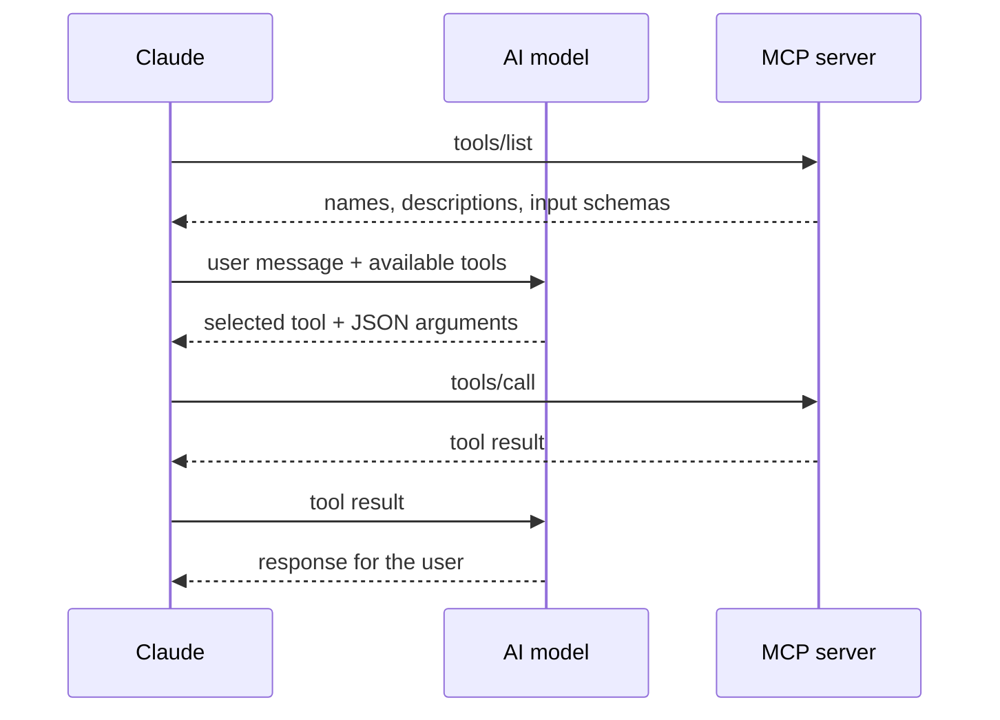
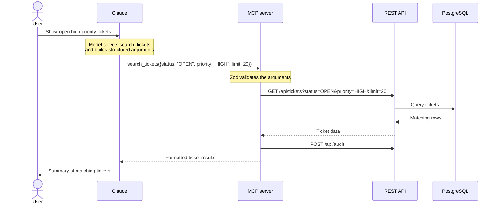
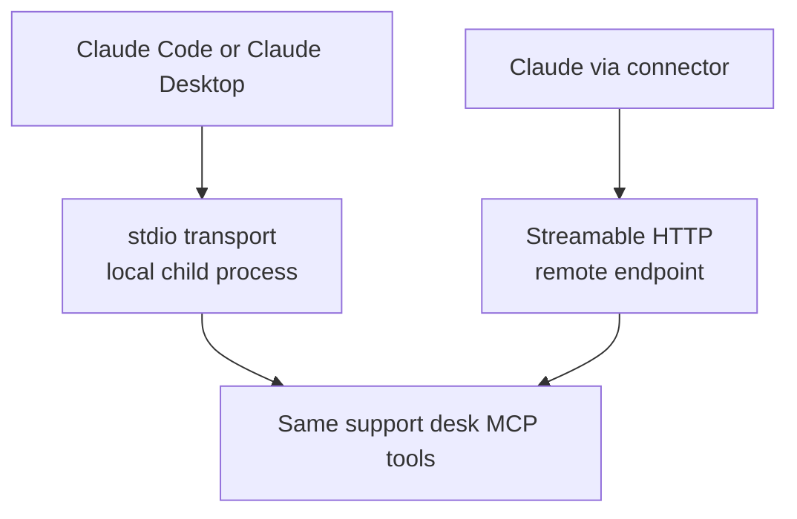
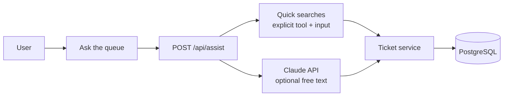

# How MCP fits together

This guide is for engineers who are comfortable with APIs but new to MCP.

## Start with familiar pieces

An MCP server is similar to a typed API adapter. It publishes a list of operations, describes the arguments each operation accepts, validates calls, and returns structured results.

The unusual part is the caller. Instead of application code choosing an endpoint directly, an AI model chooses a tool based on the user's request and the tool definitions supplied by an MCP client.



Each part has one job:

- **User:** describes the desired outcome in normal language.
- **AI model:** chooses a tool and produces its arguments.
- **MCP client (Claude):** gives the model access to tool definitions and carries MCP messages.
- **MCP server:** validates the arguments, runs the selected tool, and returns a result.
- **REST API:** owns the support desk business logic.
- **PostgreSQL:** stores tickets, comments, agents, and audit entries.

The model does not connect to the database. The MCP server does not interpret the user's sentence. Those responsibilities stay in separate layers.

## Tool discovery

Before a model can call a tool, the client asks the MCP server what is available.



For this project, `search_tickets` is advertised with a description and a schema equivalent to:

```json
{
  "query": "string, optional",
  "status": "OPEN | IN_PROGRESS | WAITING | RESOLVED | CLOSED, optional",
  "priority": "LOW | MEDIUM | HIGH | URGENT, optional",
  "assigneeId": "string, optional",
  "limit": "number"
}
```

That schema comes from `searchTicketsInputSchema` in `packages/shared/src/schemas.ts`. The MCP SDK turns it into a tool definition that Claude can provide to the model.

## A concrete request

Suppose the user asks:

> Show open high priority tickets.

The complete flow is:



The model inside Claude performs the language-to-JSON step:

```text
"Show open high priority tickets"
                |
                v
search_tickets({
  status: "OPEN",
  priority: "HIGH",
  limit: 20
})
```

Your MCP server receives the JSON call, not the original sentence. Its handler maps those arguments to query parameters:

```typescript
client.get('/api/tickets', {
  status: args.status,
  priority: args.priority,
  limit: args.limit,
});
```

This split is important. The model handles language. The server handles validation, authorization, business operations, and audit logging.

## MCP is not the model

These terms are related but not interchangeable:

| Term | Role |
|------|------|
| AI model | Chooses tools and writes responses |
| MCP client | Hosts the model interaction and connects to MCP servers (Claude in this project) |
| MCP server | Publishes and executes tools |
| Tool | A named operation with a description and input schema |
| Transport | How MCP messages move between client and server |

Claude is the client. This repository provides the server.

## Why there are two transports

The protocol messages are the same, but Claude can reach the server in different ways.



- **stdio:** Claude Code or Claude Desktop starts the MCP server as a local process and communicates through standard input and output.
- **Streamable HTTP:** the MCP server runs independently and Claude connects to its `/mcp` URL (often through a hosted connector).

The transport does not change the tools. Both entry points call `createMcpServer()` and register the same handlers.

## Ask the queue (web UI)

The web panel is not MCP. It calls the same tools through the REST API and logs to the same audit trail.



**Quick searches** (the suggestion buttons) map to fixed tool calls defined in `packages/shared/src/quick-searches.ts`. No parsing guesswork: `"Show open tickets"` always becomes `search_tickets({ status: "OPEN", limit: 10 })`.

**Free-text questions** work when `ANTHROPIC_API_KEY` is set on the API. Claude picks tools from the same Zod schemas as MCP. Without that key, the text field is disabled and you use quick searches or Claude via MCP.

| Claude + MCP path | Ask the queue path |
|-------------------|--------------------|
| Claude client speaks MCP | Browser speaks HTTP to `/api/assist` |
| Model picks tools via MCP | Model picks tools via Anthropic API (optional) |
| MCP server calls the REST API | API calls ticket service in-process |
| Quick searches always work in browser | Quick searches always work in browser |

Both paths use the same ticket data and write to the same audit log.

## What MCP adds

Without MCP, every AI client would need a custom integration for this support desk. MCP provides a common contract for:

- listing available tools;
- describing tool inputs with JSON Schema;
- validating structured arguments;
- calling tools over local or remote transports;
- returning results in a predictable format.

The REST API is still useful. It is the application's internal boundary and serves the web UI. MCP adds a standard AI-facing boundary without moving business logic into prompts or client-specific plugins.

## Safety in this project

Tool use should be treated like any other untrusted request:

- Zod validates every tool input.
- The HTTP transport requires an API key.
- `add_comment` requires `confirmed: true`.
- The API owns database access.
- Every tool call is written to the audit log.
- The Tool log shows the actor, arguments, status, and result details.

The model can propose a call, but the application still decides what is valid and what is allowed.

## Where to read the code

| Concern | File |
|---------|------|
| Tool schemas | `packages/shared/src/schemas.ts` |
| Tool registration and API mapping | `apps/mcp-server/src/tools/register-tools.ts` |
| MCP server factory | `apps/mcp-server/src/server.ts` |
| stdio entry point | `apps/mcp-server/src/index.ts` |
| Streamable HTTP entry point | `apps/mcp-server/src/http.ts` |
| REST routes | `apps/api/src/routes/index.ts` |
| Ask the queue routing | `apps/api/src/services/assist.service.ts` |
| Quick search definitions | `packages/shared/src/quick-searches.ts` |
| Claude assist (optional) | `apps/api/src/services/claude-assist.service.ts` |
| Audit log UI | `apps/web/src/components/AuditTimeline.tsx` |

For connection examples, continue with [MCP client setup](./mcp-clients.md). For a runnable walkthrough, see [Walkthrough](./demo.md).
